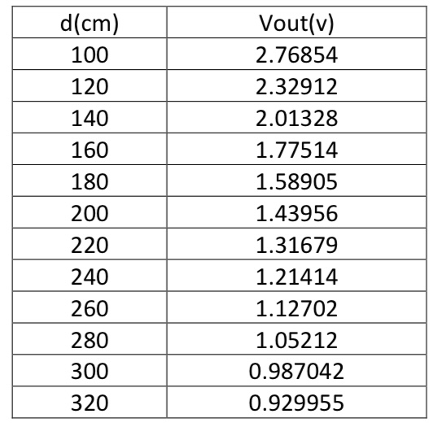

# Distance_Sensor
Implementation of a **GP2Y0A700K0F** distance measuring sensor in STM32.

I connected the sensor to a **voltage source** of 5 volts. The final design is as below:

By connecting a **voltmeter** to the output of the sensor, I measured the output of the sensor in enough points in the range of its possible input values. The results are shown in the table below:

By using the above dataset in MATLAB **cftool**, I found the **regression line** corresponding to the dataset:

By using this equation, I was able to write a program to measure the distance in centimeters and print the result on an LCD display connected to the STM32 micro-controller.

